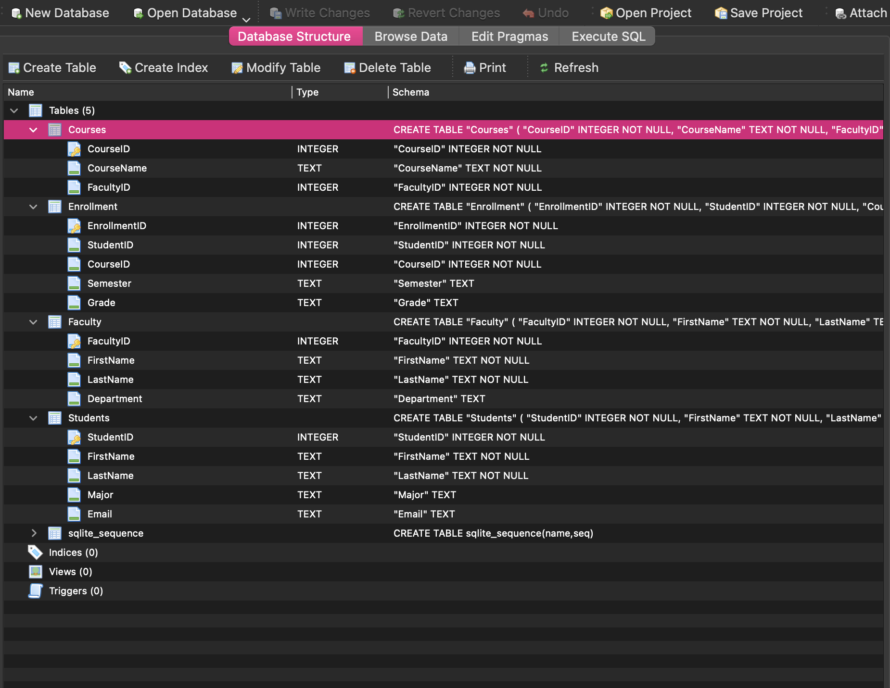
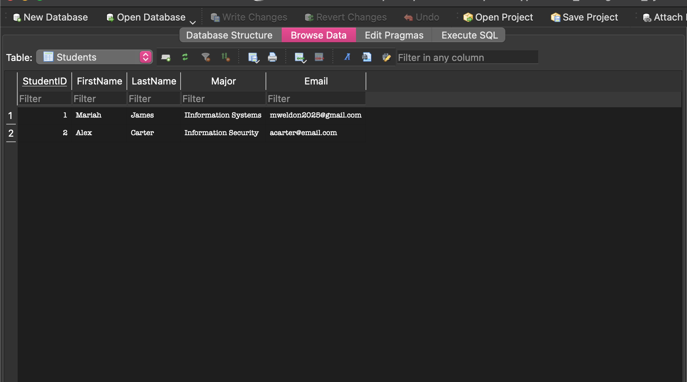
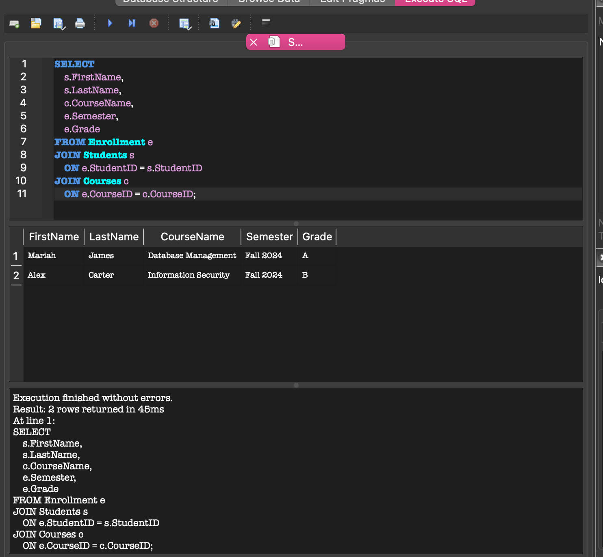

# Database Management System

## Overview

Designed and implemented a relational database system using SQLite to manage students, faculty, courses, and enrollment records. The project demonstrates database design principles, data modeling, and SQL query development through a structured academic information system.

## My Role

- Designed and implemented the database schema.
- Created tables for Students, Faculty, Courses, and Enrollment.
- Populated the database with sample records.
- Developed SQL JOIN queries to retrieve information across multiple tables.
- Documented the database structure and query results.

## Features

- Student information management
- Faculty and department tracking
- Course management
- Enrollment and grade tracking
- Relational database design
- Multi-table SQL queries and data retrieval

## Database Tables

### Students
Stores student information including names, majors, and email addresses.

### Faculty
Maintains faculty information and department assignments.

### Courses
Stores course information and associated faculty members.

### Enrollment
Tracks student enrollment records, semesters, and grades.

## Sample SQL Query

Used SQL JOIN statements to retrieve student names, course names, semester information, and grades across multiple related tables.

```sql
SELECT
    s.FirstName,
    s.LastName,
    c.CourseName,
    e.Semester,
    e.Grade
FROM Enrollment e
JOIN Students s
    ON e.StudentID = s.StudentID
JOIN Courses c
    ON e.CourseID = c.CourseID;
```

## Technologies Used

- SQLite
- SQL
- DB Browser for SQLite
- GitHub

## Skills Demonstrated

- Database Design
- Data Modeling
- SQL Query Development
- Relational Database Concepts
- Data Management
- Structured Query Language (SQL)
- Database Documentation

## Project Files

- `database_management_system.db`
- `DMDocumentation.pdf`
- `table_structure.png`
- `sample_data.png`
- `sql_query_results.png`

## Screenshots

### Database Structure



### Sample Data



### SQL Query Results



## Duration

May 2024 – July 2024

## Author

**Mariah Weldon**  
B.B.A. Information Systems | Kennesaw State University
